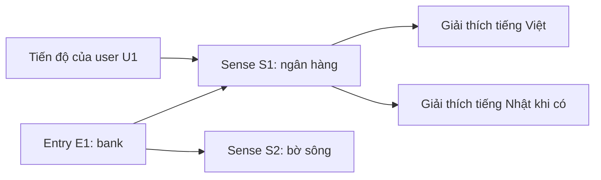

# Giải thích các hướng thiết kế cho người mới

Ngày: 02/10/2026. Diễn giải các phương án đã research, **chưa chốt schema,
provider hoặc kiến trúc triển khai**. Các ID và dữ liệu dưới đây chỉ minh họa.

## 1. Schema, bảng và ID là gì?

Database giống một tập bảng có liên hệ với nhau. Mỗi dòng là một mục dữ liệu;
mỗi cột là một thuộc tính. Schema mô tả các bảng, thuộc tính và quy tắc liên hệ.
ID là mã nhận diện một mục: tên/giải thích có thể sửa, mã vẫn trỏ đến đúng mục.

Ví dụ một bảng ghi `word=bank`, `meaning_vi=ngân hàng` dễ dùng cho bản đầu.
Nếu giữ thiết kế cột theo ngôn ngữ, thêm tiếng Nhật thường cần thêm cột và
chỉnh code đọc/ghi nó. Hướng mới cho language thành dữ liệu trong từng dòng;
thêm ngôn ngữ có thể thêm dòng thay vì đổi bảng.

## 2. Vì sao tách từ, nghĩa và lời giải thích?

Ba khái niệm khác nhau:

- **Entry:** từ/cụm từ đang học, ngôn ngữ và loại từ. Ví dụ bank, English, noun.
- **Sense:** một nghĩa của entry. Bank/ngân hàng và bank/bờ sông là hai sense.
- **Localized text:** cách diễn đạt cùng một sense bằng một ngôn ngữ giải thích.

Ví dụ các bảng của option đang đề xuất:

| Bảng | Một số dòng minh họa |
| --- | --- |
| Entries | E1: bank, language=en, part_of_speech=noun |
| Senses | S1 thuộc E1, nghĩa ngân hàng; S2 thuộc E1, nghĩa bờ sông |
| Sense texts | S1/vi: giải thích tiếng Việt; S1/ja: bản tiếng Nhật khi có; S2/vi: giải thích nghĩa bờ sông |
| Progress | User U1 + S1: đã biết; User U1 + S2: cần ôn tập |

User đổi ngôn ngữ giải thích cho S1 thì vẫn học S1, nên không reset tiến độ.
User luyện S2 là nghĩa khác, có thể có tiến độ khác. User khác có tiến độ riêng.
Thêm tiếng Nhật là thêm nội dung được biên tập cho dòng S1/ja; schema không
tự tạo bản dịch hoặc làm AI chấm được ngôn ngữ học mới.

App vẫn có thể hiển thị một thẻ gọn. Backend đọc các bảng theo ID và gộp dữ
liệu cho thẻ; số bảng trong DB không quyết định số màn hình trên app.

Trade-off: nhiều bảng và truy vấn có liên kết hơn. Lợi ích là không phải sao
chép cả entry/progress cho mỗi bản dịch. Nếu V1 cần ít công hơn, có option
giữ một item/nghĩa và chỉ tách bảng text; đổi lại thông tin từ lặp giữa các nghĩa.

## 3. Module là gì, vì sao chưa cần nhiều server?

Module là một phần code có công việc rõ. Trong một app NestJS có thể có:
Content quản lý từ/nghĩa; Learning quản lý nhóm/tiến độ; Practice quản lý bài
và tiêu chí chấm; AI Integration gọi model; Entitlements kiểm tra quyền AI.

Khi user nộp bài: Practice xác định bài/đáp án cần xử lý → kiểm tra quyền →
nhờ AI Integration đánh giá theo rubric → lưu kết quả. Practice không tự quyết
định trạng thái thanh toán, AI provider không tự quyết định quyền Pro, và
kết quả bài không tự đổi trạng thái flashcard user đã chọn.

Đây là chia trách nhiệm **trong cùng codebase/deployment**. Nếu dùng nhiều
server riêng để chạy các module thành service độc lập, phải xử lý thêm mạng,
deployment, trạng thái giữa các service và recovery. Lợi ích tách service chỉ
nên so với chi phí ấy khi có nhu cầu/tải/ownership cụ thể.

Trade-off của modular monolith: ít vận hành hơn nhưng code phải giữ ranh giới.
Mỗi module có đường ghi dữ liệu rõ; nếu mọi module sửa bảng của nhau thì việc
chia thư mục không tạo ra khả năng thay đổi độc lập.

## 4. Adapter và API contract: chỗ nối để thay nguồn

API là cách hai chương trình giao tiếp bằng request/response. Có ba chỗ khác
nhau trong dự án: app gọi backend của mình; backend có thể gọi dictionary
provider; backend gọi AI provider. Website từ điển cũng có request riêng của
nó, không tự đồng nghĩa mọi endpoint được quan sát là API public dành cho app.

Giả sử nguồn A và B trả nghĩa bằng hai cấu trúc khác nhau. Dictionary adapter
là phần code chuyển cấu trúc của từng nguồn về cấu trúc content app hiểu.
Learning/Practice làm việc với ID/nghĩa của app, không đọc raw response nguồn.
AI adapter có vai trò tương tự với model, nhưng rubric vẫn do Practice giữ.

Trade-off: thêm một lớp chuyển đổi, validation và kiểm chứng. Lợi ích là đổi
nguồn/provider ít lan ra tính năng khác. Không có nghĩa thay nguồn luôn đơn
giản: license, chất lượng và mapping các nghĩa có thể khác; không dedupe nghĩa
chỉ vì cùng chữ bank hoặc cùng vị trí trong danh sách response.

API contract là cấu trúc app và backend thống nhất. Flutter bản cũ có thể vẫn
đọc field cũ khi server đã đổi. Vì vậy thay DB không nên tự đổi mọi response;
thay đổi tương thích, kiểm tra client cũ và lịch bỏ field cũ cần rõ.
Version sản phẩm và version hợp đồng API không nhất thiết cùng số.
[Google API backwards compatibility](https://google.aip.dev/180).

## 5. Gói, lượt AI và lịch sử

Thay vì mọi chỗ hỏi `user có Pro không`, backend có thể hỏi `user có quyền
luyện AI lúc này không` và `còn hạn mức không`. Pro/trial là nguồn cấp quyền.
Nếu thêm gói sau này, cấu hình quyền có thể đổi mà không sửa mọi màn hình/
luồng AI. Trade-off là cần quản lý thời hạn và usage rõ; chưa cần rule engine
tổng quát. Free AI, quyền trong trial và quota vẫn chưa chốt.

Operation ID là mã cho một lượt thao tác. User bấm gửi hai lần hoặc mạng mất
sau khi lưu thì backend nhận ra cùng lượt, tránh lưu hai kết quả/trừ quota
hai lần theo policy. Provider bên ngoài vẫn có thể tính phí các lần gọi retry,
nên chi phí provider và quota user phải được theo dõi riêng.

Snapshot là bản nội dung đề ở lúc tạo bài; version cho biết rubric/model/
nội dung nào đã dùng. User đang làm bài thì catalog được sửa: hệ thống vẫn
biết họ đã nhìn đề nào. Trade-off là phải lưu thêm dữ liệu và chốt retention.

## 6. Nhiều tính năng khác với nhiều lượt sử dụng

Thêm bản giải thích tiếng Nhật thay đổi nội dung. Một trăm lượt tra bank giống
nhau trong thời gian ngắn là vấn đề tải. Hai nhu cầu này dùng các cách khác nhau.

| Công cụ/cách làm | Hiểu đơn giản | Trade-off |
| --- | --- | --- |
| Index | Mục lục giúp DB tìm những dòng cần đọc theo query. | Tốn dung lượng và công cập nhật khi ghi. |
| Pagination | Trả một phần danh sách mỗi lần. | Client phải tải trang tiếp; thứ tự/cursor phải rõ. |
| Cache | Giữ bản nội dung hay đọc để tránh đọc/tính lặp. | Phải biết lúc nào bản giữ lại đã cũ; dữ liệu riêng cần đúng quyền. |
| Worker | Xử lý việc lâu ở process riêng, nếu core flow cần. | Theo dõi trạng thái, retry, duplicate và deadline; tăng worker phải kiểm soát chi phí. |
| Nhiều API instances | Nhiều bản backend cùng nhận request. | DB/session/quota vẫn phải dùng trạng thái chung; có thể đẩy bottleneck sang DB hoặc provider. |

Đề xuất đo phần nào chậm trước: query DB, kết nối, CPU, backlog hay AI provider.
Thêm server không bảo đảm nhanh hơn nếu bottleneck vẫn ở query hoặc provider.
Chưa có measurement để cam kết số user/RPS, chọn replica/shard hay topology.

## 7. Liên hệ nghiên cứu session từ điển

Xem [tổng hợp session](DICTIONARY_API_SESSION_SUMMARY_2026-10-02.md). Phân biệt
quan sát Network website với đánh giá API public/license. Pattern tải nội dung,
gợi ý khi gõ, cache asset và tải media khi cần là bài học để so sánh; không tự
thành quyết định chọn provider, import nội dung hoặc thêm audio vào V1.

Người dùng sau đó đã chọn hybrid cho nguồn từ vựng (catalog DB + nguồn ngoài).
Các hướng schema/subsystem trên vẫn proposed. Khi lựa chọn một subsystem cụ thể, dùng
[Defense Analysis](DECISION_ANALYSIS_TEMPLATE.md) cùng options, failure và
migration/rollback; không làm lại một spec lớn chỉ để giải thích các khái niệm.
