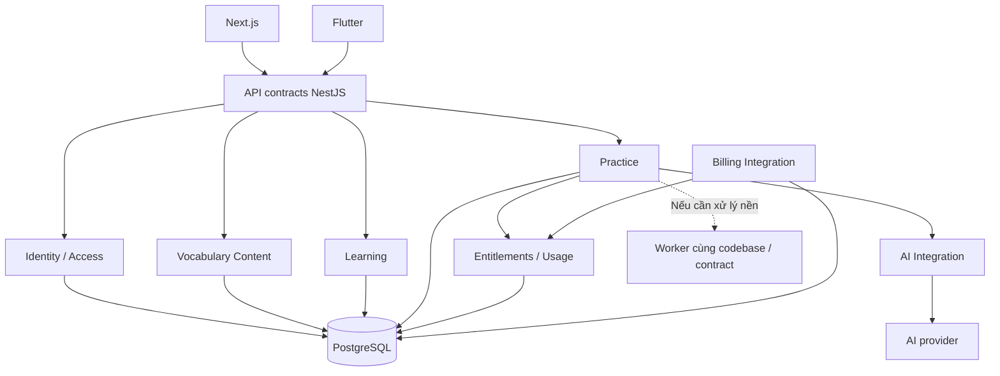

# Hướng thiết kế để mở rộng sản phẩm và tải — các phương án

Ngày: 02/10/2026. **Trạng thái: research + đề xuất cho schema và subsystem.**
Người dùng đã chọn riêng **hybrid cho nguồn từ vựng** (catalog DB + nguồn ngoài);
provider và cách triển khai chưa chốt. Đây không phải lựa chọn hybrid retrieval.
Nguồn yêu cầu: người dùng yêu cầu rà lại toàn hệ thống để tiến hóa qua các
version sau, nêu trade-off và hướng triển khai; chưa chốt thiết kế hoặc code.

## 1. Ràng buộc và cách hiểu yêu cầu

Đã xác nhận: Next.js web, Flutter mobile, hướng NestJS modular monolith và
PostgreSQL; app học từ vựng với flashcard/AI; Free/Pro, Pro có AI, trial 14 ngày.
V3/V4/V5 là ví dụ cho các phiên bản tương lai, **chưa có feature của các bản đó**.
Không biến kịch bản tương lai thành yêu cầu MVP hoặc lời hứa sẽ scale được.

Schema cũ có `meaning_vi`, `definition_en`, `example_en` trong cùng item:
nó khiến thêm ngôn ngữ/nội dung phải thay schema. Đó là hạn chế tiến hóa đã
nhìn thấy; chưa có benchmark để kết luận giới hạn tải của schema/monolith.

| Loại mở rộng | Cần bảo vệ | Cách kiểm chứng |
| --- | --- | --- |
| Thêm tính năng/ngôn ngữ/provider/gói | Stable ID, ranh giới trách nhiệm, schema/contract có version và migration. | Thử thay đổi một phần mà không sửa mọi module/client hoặc mất lịch sử. |
| Nhiều dữ liệu/request/job hơn | Query, pool connections, bounded concurrency, tài nguyên và chi phí. | Load test theo core flow rồi đối chiếu production; tìm bottleneck trước tăng hạ tầng. |
| Nhiều người cùng phát triển/vận hành | Quyền sở hữu module, giao diện rõ, deployment/recovery có trách nhiệm. | Review dependency, incident ownership và tác động release. Chưa giả định có nhiều team. |

Mục tiêu đề xuất: chi phí thay đổi tương lai có thể quản lý; V1 vẫn ship được.
Không có schema nào loại bỏ mọi migration hoặc đảm bảo scale cho feature chưa biết.

## 2. Phương án cho nội dung đa ngôn ngữ

| Option | Ưu điểm | Chi phí / hạn chế | Khi phù hợp |
| --- | --- | --- | --- |
| A. Cột `meaning_vi`, `meaning_ja`… | Form/query đầu tiên đơn giản. | Thêm ngôn ngữ đổi schema/API; khó version/duyệt/nguồn riêng. | Bài toán cố định rất ít ngôn ngữ. Không nghiêng về option này với yêu cầu mới. |
| B. JSONB chứa map ngôn ngữ | Thêm key nhanh, lấy một item gọn; PostgreSQL có index JSONB. | Cần schema validation; duyệt, provenance, unique và sửa từng bản dịch phức tạp; update khóa cả row. | Payload nhỏ ít cập nhật, metadata linh hoạt. |
| C. Item theo một nghĩa + bảng localized texts | Thêm ngôn ngữ bằng row; tiến độ bám item ID; ít bảng hơn D. | Lemma/loại từ lặp giữa các nghĩa; khó quản lý thuộc tính chung/biến thể từ khi dictionary sâu hơn. | Ưu tiên đơn giản V1 nhưng vẫn đa ngôn ngữ. |
| D. Entry → senses → localized texts | Tách từ, nghĩa và cách diễn đạt; phù hợp nhiều nghĩa, nguồn level ở mức entry/POS và nội dung theo ngôn ngữ. | Nhiều bảng/join, import và validation cần rõ; không thay được công sức biên tập ngôn ngữ mới. | Catalog có nhiều nghĩa và muốn quản lý nội dung lâu dài. |

**Đề xuất đang nghiêng:** D cho catalog dài hạn; C là phương án ít công hơn
nếu thời gian V1 không đủ. Lý do dùng D ở đây đến từ cấu trúc từ điển/đa nghĩa
đã có, không phải để tạo framework từ điển tổng quát. Xem [schema được viết lại](V1_DATA_MODEL_DRAFT.md).

WikibaseLexeme phân biệt lexeme, forms, senses và gloss đa ngôn ngữ; đây là
tham khảo về mô hình nội dung, không phải yêu cầu dùng Wikibase/RDF hay chọn
Wikidata làm nguồn dữ liệu. [Wikibase data model](https://www.mediawiki.org/wiki/Extension:WikibaseLexeme/Data_Model).
Trade-off JSONB lấy từ [PostgreSQL JSON Types](https://www.postgresql.org/docs/current/datatype-json.html);
phần lựa chọn C/D là suy luận áp dụng cho app, chưa có thử nghiệm hiệu năng.

Tách ba giá trị: **ngôn ngữ đang học**, **ngôn ngữ giải thích**, **locale UI**.
User đổi locale UI không được tự đổi nội dung học, nghĩa mục tiêu hoặc rubric.
Language tags dùng dạng BCP 47 như `en`, `vi`, `ja`; canonicalize/validate theo
registry thay vì enum chỉ gồm English/Vietnamese. Hỗ trợ tag không tự có nghĩa
đã có content/model chấm được ngôn ngữ ấy. [W3C language tags](https://www.w3.org/International/articles/language-tags/index.en).

## 3. Ranh giới module đề xuất

Giữ một ứng dụng backend với module theo năng lực sản phẩm; mỗi module sở hữu
logic và đường ghi dữ liệu của mình. Module khác gọi service contract, không
sửa bảng của nhau hoặc phụ thuộc mọi ORM entity. Read projection/join qua module
trong cùng DB có thể dùng khi có lợi, nhưng ghi rõ dependency/transaction để
biết chi phí tách sau; chưa cấm toàn bộ cross-module join/FK từ V1.

| Module | Sở hữu | Ranh giới cần giữ |
| --- | --- | --- |
| Identity & Access | User ID, login identity, session, quyền tài nguyên. | User ID khác email/provider subject; role truy cập khác plan trả phí. |
| Vocabulary Content | Entry/sense/localization/topic/level/source/publication. | Nội dung public đã duyệt khác custom private; import provider phải map vào model của app. |
| Learning | Nhóm, item tham chiếu, trạng thái user tự chọn. | Không thay tiến độ vì đổi bản dịch/model hoặc một đáp án đúng. |
| Practice | Question/attempt, rubric, grading state. | Mục tiêu sư phạm và kết quả không phụ thuộc raw response của provider. |
| AI Integration | Provider adapter, capabilities, timeout, token/cost. | Đổi provider qua mapping/capability test; không đảm bảo mọi provider tương đương. |
| Entitlements & Usage | Quyền feature, trial, quota/reservation/usage. | Billing gửi trạng thái quyền qua contract; server kiểm tra quyền, không tin client. |
| Billing Integration | Trạng thái thanh toán/subscription và external events khi có thu phí. | Không rải `if plan == pro` hoặc payload provider qua domain/frontend. |

Sơ đồ logic để đọc trách nhiệm, **không phải sơ đồ các microservice**:

Bounded context có thể là ranh giới logic trong monolith theo [Microsoft architecture guidance](https://learn.microsoft.com/en-us/dotnet/architecture/microservices/architect-microservice-container-applications/data-sovereignty-per-microservice).
GitHub mô tả tách các bảng theo schema domain và kiểm tra dependency trước khi
di chuyển dữ liệu vật lý. Điều áp dụng ở V1 là ownership/dependency rõ; không
sao chép SQL linter hoặc topology của GitHub ngay. [GitHub database domains](https://github.blog/engineering/partitioning-githubs-relational-databases-scale/).

## 4. Các phần khác: options và hướng đang nghiêng

| Phần | Option đơn giản / option mở rộng | Hướng đề xuất và trade-off | Điều kiện rà lại |
| --- | --- | --- | --- |
| Domain/deployment | Monolith lẫn trách nhiệm / modular monolith / microservices. | Modular monolith: có transaction trong một DB, ít vận hành hơn; phải giữ boundary có kỷ luật. Tách service cần thêm consistency/network/ops. | Module có tải/release/team độc lập và chi phí tách có lợi đã đo. |
| UI và API | Client nhận nguyên DB entity / DTO contract + OpenAPI. | DTO có version độc lập DB; hai client dùng cùng semantics, có thể generate client sau. Thêm công maintain contract/test. | Mobile bản cũ không dùng được API mới; nhu cầu client khác. |
| Question types | Hai cột/if cố định / `type` + payload schema version + handler theo type / plugin framework. | Handler có validation cho hai type V1, JSONB chỉ cho payload khác nhau; invariant/query fields vẫn relational. Chưa cần plugin loader chung. | Type mới có workflow thật khác; enum client cần forward compatibility. |
| Grading/AI | Gắn prompt/model ngay controller / application service + provider adapter. | Practice sở hữu rubric, AI adapter map response; version normalization theo target language. Thêm lớp mapping/evaluation; đổi model không tự đạt chất lượng cũ. | Provider/cost/capability hoặc ngôn ngữ học thay đổi. |
| Plan/quota | `is_pro` boolean / feature entitlements + usage ledger / rule engine. | Quyền cụ thể như `ai.practice`, có hạn/nguồn cấp, quota atomic theo operation. Có thêm bảng và reconciliation, nhưng đổi gói không sửa mọi flow. Chưa cần rule engine. | Thêm gói/feature/metering; refund/cancel/chargeback policy. |
| Session/identity | User chính là email / user ID + auth identities/session. | ID nội bộ ổn định; provider+subject mapping. Linking phải xác minh, không ghép email thiếu kiểm chứng. RLS là lớp thêm tùy chọn, không thay auth ở app. | Thêm login provider, workspace chia sẻ hoặc incident quyền. |
| Tác vụ nền | Request trực tiếp / durable operation và worker / broker nhiều service. | Request trực tiếp nếu latency cho phép; durable worker khi cần, idempotency/retry hữu hạn. DB→queue critical cần outbox hoặc operation table được relay bền vững. | Deadline HTTP, backlog, import hoặc retry cần sống qua process restart. |
| Search/RAG | Lookup/query PG / FTS-vector trên dữ liệu app / engine riêng. | Lookup trước, derived index có thể rebuild; quyền riêng/public và content version đi cùng retrieval. Index nâng cao tăng sync/evaluation/ops. | Có query mới cần semantic search, quality/latency đã đo; V1.5 vẫn có điều kiện. |
| Cross-device | Online chung DB / optimistic version / offline sync+conflict protocol. | Online + version khi user sửa trạng thái đủ cho baseline. Tombstone/change log và conflict resolution thêm khi có offline, không mặc định CRDT. | Người dùng thực sự cần offline hoặc cộng tác. |
| Analytics | Query trực tiếp DB vận hành / events/projections / warehouse. | Events có version và retention; các số liệu nhỏ có thể query PG. Không tạo event-sourcing chỉ để theo dõi lượt dùng. | Báo cáo làm chậm core flow hoặc volume/retention vượt khả năng. |

Google AIP-180 cảnh báo thêm field/enum/default có thể phá client cũ; đề xuất
API thay đổi additive và test Flutter cũ/Next.js mới, xử lý unknown enum và
field optional. **Version sản phẩm V3/V4 không tự là `/api/v3`/`/api/v4`**.
Breaking API change mới cần contract version/migration window; thời gian hỗ trợ
client cũ chưa chốt. [Google backwards compatibility](https://google.aip.dev/180).

Outbox giúp xử lý việc commit DB nhưng mất message; vẫn phải chống duplicate ở
consumer. Không cần Kafka cho pattern này. [AWS transactional outbox](https://docs.aws.amazon.com/prescriptive-guidance/latest/cloud-design-patterns/transactional-outbox.html).
Stripe nêu webhook có thể trùng và không theo thứ tự: nếu chọn Stripe, signature,
durable event receipt, dedupe, xử lý trạng thái và reconciliation là bắt buộc;
không dùng timestamp event như một bảo đảm thứ tự. Đây là tham khảo integration,
**chưa chọn Stripe**. [Stripe webhook delivery](https://docs.stripe.com/webhooks).

## 5. Lộ trình chịu tải theo bằng chứng

| Bước / option | Lợi ích | Đánh đổi / điều kiện |
| --- | --- | --- |
| Query + index + pagination + connection budget | Giảm việc DB phải làm, giới hạn response và số kết nối của API/worker. | Index tốn storage và làm tăng chi phí ghi. Chọn bằng query plan/đo; không index mọi field. |
| Tăng CPU/RAM/IO DB hoặc API | Ít thay đổi logic. | Trần tài nguyên/chi phí; không sửa query tệ hoặc provider rate limit. |
| Thêm API instances / worker concurrency hữu hạn | Tăng công suất lớp app khi app là bottleneck. | State/session/idempotency phải ở kho chung; pool tổng và provider quota có thể quá tải. |
| Cache catalog public có version / read replica | Giảm đọc lặp hoặc chia tải đọc. | Cache invalidation và replica lag; quyền/usage và đọc sau ghi quan trọng dùng nguồn nhất quán. |
| Partition/archive attempt/usage khi lớn | Quản lý retention, giảm scan ở query phù hợp. | Query/unique/maintenance đổi; không phải tự sharding. Giữ dedupe invariant khi thay partition key. |
| Tách domain DB/service hoặc shard | Giải quyết bottleneck/ownership khó xử lý ở bước trước. | Mất transaction/FK liên domain, cần reconciliation và vận hành phân tán; là decision mới. |

Replica có thể chưa thấy thay đổi gần nhất; [PostgreSQL hot standby](https://www.postgresql.org/docs/current/hot-standby.html).
Partitioning hữu ích tùy kích thước/pattern chứ không mặc định cải thiện mọi
query; [PostgreSQL partitioning](https://www.postgresql.org/docs/current/ddl-partitioning.html).
Chưa có workload, hardware, ngân sách hay measurement để cam kết số user/RPS.
Không tăng hạ tầng chỉ vì tên version V3; cũng không cam kết backend không cần
viết lại phần nào khi tách service.

## 6. Migration và vận hành để các version cùng tồn tại

Đề xuất: thêm schema/field tương thích → backfill có kiểm tra → deploy app đọc
được cũ/mới → chuyển dần đường đọc/ghi → theo dõi và rollback nếu lỗi → chỉ bỏ
schema cũ sau cửa sổ hỗ trợ. Dual-write nếu thực sự cần phải có cách phát hiện
và reconcile lệch; không xem hai lệnh ghi là atomic tự động.

Question giữ snapshot + content/rubric/schema version để cập nhật bản dịch không
âm thầm đổi đề cũ. Nếu nghĩa thực sự thay đổi/tách/gộp, phải định nghĩa mapping
và ảnh hưởng progress; không reuse ID cũ cho một nghĩa khác. Index/cache/RAG là
dữ liệu dẫn xuất có thể rebuild từ content được phép dùng, không nguồn sự thật.

Đề xuất trace/log/metric gắn operation ID, module, version, latency/error/cost;
không log credential hoặc toàn bộ input riêng mặc định. Metric label tránh ID
user/attempt có cardinality không giới hạn. [OpenTelemetry signals](https://opentelemetry.io/docs/concepts/signals/).
SLO gắn với flow user: lưu trạng thái, mở catalog, tạo/chấm bài; tách AI/provider
latency khỏi DB/API. Ngưỡng sẽ chọn theo trải nghiệm/pilot và budget, không bịa
mức availability/công suất. [Google SRE SLO](https://sre.google/sre-book/service-level-objectives/).

## 7. Defense Analysis ở mức định hướng

**Decision này cần Defense Analysis trước khi chốt spec.** Hint: user đổi ngôn
ngữ giải thích có mất tiến độ không? Translation bị xóa khi bài đang làm thì
chấm theo gì? Mobile bản cũ gặp type mới xử lý thế nào? Queue/webhook giao hai
lần thì quyền và quota nào còn đúng? Các câu hỏi này để review, không xin phép.

Happy path kịch bản: user login → đọc sense bằng ngôn ngữ hỗ trợ → lưu progress
theo sense ID → server nhận tác vụ theo quyền/quota → tạo/chấm với snapshot và
rubric → hoàn tất một kết quả → client cũ/mới đọc qua contract tương thích.

Invariants đề xuất: đổi translation không đổi identity nghĩa/progress; private
content không đi vào public cache/retrieval; không cấp quota/quyền từ client;
retry không tạo hai side effect đã commit; tác vụ lỗi không thành đáp án sai.

| Case | Hành vi / bảo vệ | Phát hiện → recovery | Verification dự kiến |
| --- | --- | --- | --- |
| Thiếu bản dịch, tag không hỗ trợ | Tách requested/resolved language; fallback explicit theo policy hoặc báo thiếu, không tự giả có bản dịch. | Missing-translation metric → bổ sung hoặc sửa fallback. | vi/ja/tag lạ/region fallback; không ảnh hưởng tiến độ. |
| Sửa bản dịch / thay nghĩa | ID bền vững, nội dung có revision; thay nghĩa cần mapping, bài dùng snapshot. | Content/version audit → quay lại revision hoặc migration được duyệt. | Sửa text, tách/gộp sense, bài cũ và progress cùng tồn tại. |
| Race publish/import/custom | Transaction publish phần cần thiết; validation source/scope; optimistic version cho edit. | Conflict/incomplete import → rollback batch nhỏ, resume theo operation ID. | Hai editor publish, import lặp, thiếu parent/source. |
| UI/API cũ gặp data mới | Contract version, enum fallback và loại bài chỉ phát cho client có capability. | Version/type error → giữ type cũ hoặc rollback rollout. | Flutter cũ nhận field/enum/type mới; bỏ field bắt buộc là breaking. |
| Job/webhook duplicate/out-of-order | Durable operation/event receipt, unique ID, finalize transaction; authority/reconcile cho payment state. | Dedupe/stale-event metrics → lấy trạng thái nguồn, replay idempotent. | Giao hai lần, đảo thứ tự, crash trước/sau commit. |
| DB commit nhưng queue/cache/index lỗi | Critical message có outbox/relay; cache/index không chặn authoritative commit nếu cho phép eventual consistency. | Outbox age/index lag → retry/rebuild, đọc DB khi cần. | Ngắt queue sau commit; index update thất bại; restart worker. |
| Provider timeout / partial result | Deadline, bounded retry/concurrency, versioned result validation; không giả exactly-once provider call. | Pending/failed/cost metrics → reconcile operation/usage, giữ chưa chấm. | Timeout đã bị provider tính phí; result đến muộn; DB save lỗi. |
| Quota hoặc entitlement hết hạn giữa flow | Atomic reservation và policy nhận/hoàn tất; tạo bài có kèm quyền chấm hay không vẫn mở. | Ledger/race detection → giải quyết reservation và quyền thực tế. | Hai request dùng đơn vị cuối, trial hết giữa tạo/nộp. |
| Private leak / prompt injection | Kiểm tra owner qua parent; cache key và retrieval filter đúng scope; input là data. RLS có thể thêm sau khi rà role/pooling. | Access/adversarial test → thu hồi, purge/reindex đúng scope, incident review. | User khác đoán ID/locale/cache; custom yêu cầu bỏ rubric. |
| Scale API nhưng DB/provider quá tải | Pool/concurrency và rate limit có tổng budget; backpressure, không mở worker vô hạn. | Pool wait/queue age/429/p95 → giảm concurrency hoặc xử lý bottleneck. | Load test từng lớp; tăng replicas không vượt connection/AI budget. |
| Migration/rollback, backup | Expand/backfill/contract theo cửa sổ compatibility; restore rehearsal, snapshot semantics. | Error/mismatch audit → rollback app tương thích hoặc sửa tiến dữ liệu. | Backfill bị ngắt; old/new client; restore dữ liệu và ledger. |

Các nhóm checklist đều đã áp dụng ở mức hướng; numeric limits, retention,
fallback, deadline, admission/quota, auth và release gates còn cần spec riêng.
RLS không phải phép bảo vệ tuyệt đối: table owner/superuser có thể bypass tùy
cấu hình. [PostgreSQL row security](https://www.postgresql.org/docs/current/ddl-rowsecurity.html).

## 8. Chuẩn bị gì ở V1, để sau gì

**Nên cân nhắc từ V1:** ID theo domain, text theo language, separation UI/content,
module ownership và DTO; scope/owner/access; operation ID; version cho
question/rubric/normalization; server entitlement/quota; pagination, backup,
telemetry và khả năng rollback. Chọn subset theo flow thực sự triển khai.

**Theo nhu cầu/measurement:** worker/outbox nếu có critical async, cache, replica,
RAG/engine search, offline sync, partition, tách service/DB và sharding. Không
tự thêm courses, lớp học/team, voice hay feature nào vào V3/V4/V5.

Mỗi decision tiếp theo cần: A/B options → lợi ích và chi phí build/operate →
hành vi khi failure → phạm vi V1 → điều kiện đổi phương án → status proposed
hoặc accepted khi có xác nhận rõ. Một lời đề nghị research/thiết kế không làm
option trở thành accepted. Chưa có code, migration, load test hoặc bằng chứng
production mới từ bản research này.
