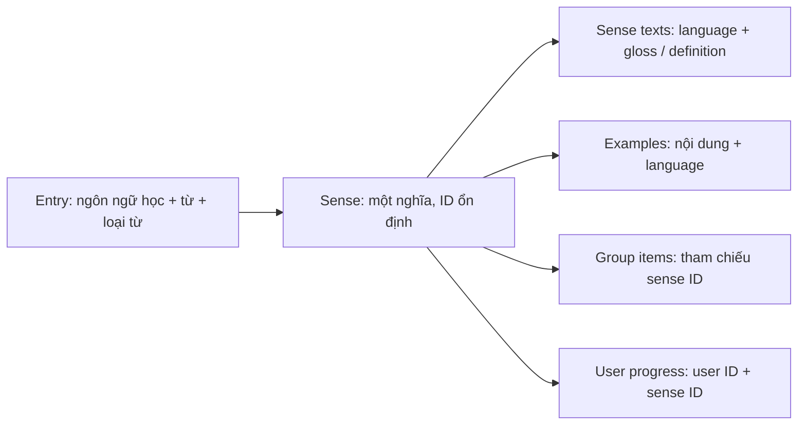

# V1 — các phương án schema cho khả năng mở rộng

Ngày: 02/10/2026. **Trạng thái: proposed, chưa tạo DB.** *Cập nhật cuối ngày 02/10: người dùng chốt **option D** (entry → sense → text theo language). Chi tiết còn mở: trường loại mục `entry_type` và cờ từ chức năng (cách B) — xem [pattern research](ARCHITECTURE_PATTERNS_RESEARCH_2026-10-02.md#1-loại-mục-từ-vựng-mở-rộng-được--phrasal-verb-collocation-idiom).*
Người dùng đã chọn **hybrid cho nguồn từ vựng**: catalog DB kết hợp nguồn ngoài.
Lựa chọn này chưa xác nhận option schema hoặc cơ chế import cụ thể.
Bản này được viết lại theo yêu cầu đa ngôn ngữ và tiến hóa toàn hệ thống.
Các cột cố định `meaning_vi`, `definition_en`, `example_en` trong proposal
trước không còn là hướng đang nghiêng. Xem [research/trade-off hệ thống](SYSTEM_EVOLUTION_OPTIONS_2026-10-02.md).

## 1. Phân biệt các hướng và mức đầu tư

| Option | Được gì | Đánh đổi |
| --- | --- | --- |
| A. Item + cột theo ngôn ngữ | Ít bảng, form/query dễ. | Thêm ngôn ngữ phải đổi schema; không phù hợp yêu cầu tiến hóa mới. |
| B. Item + JSONB map bản dịch | Thêm ngôn ngữ nhanh, payload gọn. | Validation/provenance/duyệt/index từng ngôn ngữ khó hơn; row update chung. |
| C. Item theo nghĩa + bảng text theo language | Đa ngôn ngữ và ID tiến độ ổn định, ít bảng hơn D. | Thông tin lemma/loại từ lặp giữa các nghĩa; sau này cần tách khi dictionary sâu hơn. |
| D. Entry → sense → text theo language | Từ, nghĩa, localization có identity/trách nhiệm riêng; phù hợp catalog đa nghĩa lâu dài. | Thêm bảng/join và validation/import, cần DTO gộp để UI vẫn đơn giản. |

**Đề xuất đang nghiêng về D**, với C là phương án ít công hơn cho V1. Đây là
khuyến nghị để so sánh, không phải xác nhận user đã chọn D. Không dùng EAV hoặc
một bảng JSON chứa toàn bộ user/content/progress để dự phòng feature chưa biết.
JSONB có thể bổ sung cho metadata/payload được validate, không thay mọi field
cần ownership, FK, unique hoặc query. [PostgreSQL JSON Types](https://www.postgresql.org/docs/current/datatype-json.html).

## 2. Mô hình nội dung của option D

Tiến độ bám nghĩa đang học, không bám chuỗi dịch. Một entry bank có sense ngân
hàng và sense bờ sông; các sense có text bằng nhiều ngôn ngữ. Đổi text/locale
không đổi sense ID. Thay bản chất nghĩa, tách/gộp nghĩa cần mapping/version và
quy tắc tiến độ riêng, không reuse ID cho một nghĩa khác.

Tham khảo mô hình lexeme/sense/gloss đa ngôn ngữ từ [WikibaseLexeme](https://www.mediawiki.org/wiki/Extension:WikibaseLexeme/Data_Model);
đề xuất SQL cho app là suy luận riêng, không sao chép toàn bộ RDF/Wikibase.

| Bảng | Field chính đề xuất | Constraint / trách nhiệm |
| --- | --- | --- |
| `vocabulary_entries` | `id`, `language_tag`, `lemma`, `lookup_key`, `part_of_speech`, `scope`, `owner_user_id`, `version`, timestamps | Entry ngôn ngữ đang học; scope catalog/private. Private có owner, catalog không. Lookup key không thay bản gốc; không unique chỉ theo lowercase lemma vì homograph/loại từ/ngôn ngữ khác nhau. |
| `vocabulary_senses` | `id`, `entry_id`, `publication_status`, `content_version`, timestamps | FK entry; mỗi sense một nghĩa, quyền thừa kế từ entry. Published catalog cần nội dung đạt quy trình duyệt; custom không tự public. |
| `sense_texts` | `sense_id`, `language_tag`, `gloss`, `definition`, `review_status`, `content_revision`, `source_id`, timestamps | Unique sense/language cho bản hiện hành. Nội dung của từng ngôn ngữ có revision, provenance và duyệt riêng. |
| `usage_examples` | `id`, `sense_id`, `language_tag`, `text`, `source_id`, `content_revision` | Nội dung ví dụ có ngôn ngữ; không field tên example_en. Bản dịch ví dụ nếu cần là entity/row riêng trong thiết kế sau. |
| `topics` / `topic_texts` | Topic ID, canonical slug; topic ID/language/name | ID chủ đề không đổi theo nhãn dịch. |
| `sense_topics` | `sense_id`, `topic_id` | Unique cặp ID; không gán chủ đề của một nghĩa cho mọi nghĩa cùng chữ một cách mù quáng. |
| `level_assignments` | `id`, `entry_id` hoặc `sense_id`, `framework_code`, `level_code`, `basis`, `source_id`, `version` | Chỉ một target entry hoặc sense mỗi row; FK/check và validation framework/level. Phân biệt metadata entry/POS với level của sense đã biên tập. V1 hỗ trợ CEFR A1–C2, nguồn còn mở. |
| `content_sources` | `id`, `name`, `version`, `source_url`, `license_reference`, `attribution`, thông tin quyền đã rà | Row nội dung/level giữ nguồn tương ứng; gọi được API không tự cấp quyền lưu/AI. Không chọn nguồn theo bản schema này. |

Đề xuất phân biệt `target_language_tag`, `explanation_language_tag` và
`ui_locale` trong user preferences/API. Dùng BCP 47; tag được chuẩn hóa và
kiểm tra theo registry/capability allowlist, không enum chỉ vi/en. **Có tag
không đồng nghĩa đã hỗ trợ học/chấm ngôn ngữ đó.** V1 vẫn học tiếng Anh;
ngôn ngữ giải thích mới hoặc môn học/ngôn ngữ học mới là scope riêng.
[W3C language tags](https://www.w3.org/International/articles/language-tags/index.en).

### Ví dụ cách lưu DB

| Bảng | Dòng minh họa, không phải dữ liệu thật |
| --- | --- |
| `vocabulary_entries` | E01: language=en, lemma=deploy, part_of_speech=verb, scope=catalog |
| `vocabulary_senses` | S01: entry_id=E01, nghĩa triển khai phần mềm |
| `sense_texts` | S01 + vi: gloss=triển khai phần mềm |
| `sense_texts` | S01 + ja: gloss=[nội dung tiếng Nhật sẽ biên tập/duyệt khi hỗ trợ] |
| `word_groups` | G01 thuộc U01, tên Technology |
| `group_items` | G01 tham chiếu S01 |
| `user_vocabulary` | U01 + S01, status=needs_review |

Thêm bản giải thích ngôn ngữ mới là thêm row text, không thêm cột vào entry.
Đề xuất U01 thêm S01 vào hai nhóm vẫn có một trạng thái; U02 có trạng thái
riêng. Mục tiêu luyện kỹ năng khác sau này có thể cần measurement riêng,
không ép mọi kỹ năng thành một giá trị flashcard. Hành vi này còn đề xuất.

## 3. Form/API custom đề xuất

Không bắt user hiểu toàn bộ bảng. UI có thể gửi một DTO rồi backend tạo
entry + sense + localized text + link nhóm trong transaction.

| Trường input | Ý nghĩa / validation đề xuất |
| --- | --- |
| `target_language_tag` | Ngôn ngữ của từ đang học; V1 chỉ chấp nhận khả năng đang hỗ trợ, hiện English. |
| `lemma` | Từ/cụm từ, bắt buộc; giữ bản gốc. |
| `part_of_speech` | Có thể bổ sung sau; thiếu dữ liệu quan trọng cho bài AI cần được làm rõ. |
| `explanation_language_tag` | Ngôn ngữ của gloss/definition người dùng nhập, không cố định vi trong DB. |
| `gloss` | Giải nghĩa ngắn cho nghĩa muốn học, đề xuất bắt buộc. |
| `definition` | Định nghĩa dài hơn, có thể để trống. |
| `examples` | Danh sách text + language, có thể để trống. |
| `level` / `topic_ids` | Có thể chưa phân loại; level user gán có provenance khác catalog đã biên tập. |
| `group_id` | Tùy có thêm vào nhóm ngay; phải thuộc user. |

Backend sinh ID/owner/version; không tin owner/scope/publication do client
cung cấp. Custom private dùng cùng mô hình nội dung nhưng không tự đổi catalog.
Thiếu nghĩa rõ có thể ôn thẻ nếu nội dung đủ; trước AI phải bổ sung/chọn nghĩa
hoặc báo chưa đủ dữ liệu. Không tự thêm chức năng chatbot auto-fill vào V1.

## 4. Các phần dữ liệu khác cần mở rộng được

| Phần / bảng dự kiến | Identity và field cần giữ | Trade-off / câu hỏi mở |
| --- | --- | --- |
| `users`, `auth_identities`, `auth_sessions` | User ID ổn định; identity unique provider/subject; session có expiry/revocation. | Thêm bảng so với user=email. Login/provider và policy phiên còn mở; linking phải xác minh. |
| `word_groups`, `group_items`, `user_vocabulary` | Owner tài khoản; sense ID; unique group/sense và user/sense; progress version. | Cross-device online + optimistic conflict; chưa offline sync. Xóa/retention còn cần spec. |
| `practice_questions` | Type, payload/schema version, sense IDs, snapshot, target/explanation language, rubric/normalization version. | Handler cho hai type hiện tại; type mới không tự thêm feature. Payload JSONB có schema validation; metadata/query fields relational. |
| `practice_attempts` | Question/user ID, operation ID, raw/comparison answer, status, verdict nullable, criterion summary, grader/model version. | Audit giữ được ngữ cảnh; tăng storage/retention. Không lưu chain-of-thought; không tự thêm màn hình lịch sử. |
| `ai_operations`, `ai_usage` | Stable operation ID + payload hash, status/lease version, quota reservation/finalization, token/cost mỗi provider call. | Giúp retry/reconcile; provider call vẫn có thể bị lặp/tính phí nhiều lần. User quota chỉ finalize một lần theo policy. |
| Plan catalog / `feature_entitlements` | Plan code và feature code, nguồn cấp, thời hạn/version; usage tách khỏi quyền. | Free/Pro là product hiện tại; tránh boolean Pro chung. Không cần policy/rule engine tổng quát. Quyền trial/Free AI và quota chưa chốt. |
| Billing records / external event inbox khi thu tiền | Provider/object/event IDs, receipt/processing state, subscription trạng thái chuẩn hóa. | Durable dedupe/reconcile; chi phí integration. Chưa chọn payment provider hoặc auto-charge. |
| Search/cache/retrieval projections nếu cần | Sense/content revision, ngôn ngữ, scope/owner, index version. | Có thể rebuild; không authoritative. Private deletion/revocation phải ảnh hưởng retrieval/cache phù hợp. |

Domain table tên cụ thể có thể đổi khi chốt spec. Đây không phải ERD/SQL đã
accepted; chưa chọn ORM, connection pool, index/partition hoặc billing provider.
Level/chủ đề/source A1–C2 tiếp tục research, không biến schema thành bằng chứng
đã có nội dung toàn bộ phạm vi. Question snapshot bảo vệ bài đang làm; semantic
ID và progress policy cần được khóa trước import/sửa catalog.

## 5. Defense Analysis cho data model

**Decision này cần Defense Analysis trước khi chốt spec.** Hint: đổi bản dịch
có thay trạng thái học không? Hai bản dịch mô tả hai nghĩa khác nhau thì có nên
cùng sense? Khi xóa custom, bài cũ và dữ liệu retrieval của user còn lại gì?

Happy path đề xuất: login → chọn sense hoặc tạo private entry/sense/text → lưu
nhóm + trạng thái tài khoản → đọc theo explanation language qua DTO; nếu có
quyền AI thì chấm bằng question snapshot, không nội dung vừa bị sửa.

Invariants: text thay đổi không đổi identity nghĩa; private scope thừa kế
entry và luôn kiểm tra ownership; publish không để nội dung thiếu duyệt ra
public; retry không tạo hai link/side effect; tiến độ user không đổi do locale.

| Case | Hành vi / bảo vệ đề xuất | Phát hiện → recovery | Verification dự kiến |
| --- | --- | --- | --- |
| Thiếu text/ngôn ngữ | Unique sense/language, requested/resolved language rõ; fallback policy chưa chốt, không giả translation. | Coverage metric → bổ sung bản duyệt hoặc báo chưa có. | vi/ja/tag không hỗ trợ; đổi locale không mất progress. |
| Nghĩa sai/khác giữa ngôn ngữ | Text phải mô tả cùng sense; review revision. Không chỉ check JSON hợp lệ. | QA/bất đồng nghĩa → unpublish text, sửa revision hoặc tách sense có mapping. | bank tài chính/bờ sông không nhập chung sense. |
| Concurrency / duplicate | Optimistic version, unique link; custom + text + group link trong transaction; idempotency key gắn payload. | Conflict/duplicate → đọc trạng thái hoặc rollback/retry cùng operation. | Hai thiết bị sửa; submit hai lần; lỗi giữa insert/link. |
| Publish/import partial failure | Validate parent/source/scope; publish batch nhỏ đã đủ điều kiện; không copy nghĩa thiếu provenance vào public. | Import report/incomplete rows → resume idempotent hoặc rollback batch. | Nguồn thiếu nghĩa, source trùng, DB lỗi giữa batch. |
| Sửa/xóa khi đang luyện | Snapshot content/rubric; nghĩa retired không reuse ID. Chính sách deletion/retention và mapping còn mở. | Version/audit → chấm snapshot hoặc báo bài không còn dùng được theo policy. | Sửa nghĩa giữa tạo/nộp; xóa custom; index purge. |
| Private leak / abuse | Owner check theo parent; payload giới hạn và input là data; không cache public private text. | Authorization/adversarial tests → revoke, purge cache/index, xử lý incident. | Hai user đoán entry/sense/lang ID; custom chứa markup/instruction. |
| Session/entitlement | Shared authority ở backend; login/logout không reset trial; reservation atomic. Policy tác vụ đã nhận khi trial hết còn mở. | Session/usage logs → login lại, reconcile reservation, từ chối lượt mới. | Phiên bị thu hồi, hai request dùng quota cuối, trial hết giữa flow. |
| Read replica/cache chậm | Authoritative progress/quota/access đọc đường nhất quán; content cache có revision/language/scope. | Staleness/lag metrics → đọc DB chính, invalidate/rebuild. | Đọc ngay sau đổi trạng thái/plan; private content đã xóa. |
| Recovery / rollback | Expand/backfill/contract, backup/restore và mapping IDs; không drop trước compatibility window. | Migration mismatch/errors → rollback app tương thích hoặc sửa tiến dữ liệu. | Interrupted backfill, old/new clients, restore ledger và progress. |

Observability giữ operation/content/version/lang/source context, không log
credential hoặc input riêng đầy đủ mặc định. Cache, queue/outbox, partition
và service riêng có phân tích option trong [hướng toàn hệ thống](SYSTEM_EVOLUTION_OPTIONS_2026-10-02.md).
Không cần mọi pattern ở V1; không category nào tự được chốt chỉ vì liệt kê ở đây.

## 6. Mapping từ proposal cũ và bước chốt sau

Nếu chọn D: `vocabulary_items.id` có thể map thành sense ID; text/POS sang
entry; `meaning_vi` sang gloss language=vi; `definition_en` sang definition
language=en; `example_en` sang example language=en. Group/progress chuyển tham
chiếu sang sense; kiểm tra mapping không mất nghĩa/owner. Đây là mapping khái
niệm vì hiện **chưa có DB hay client đã deploy**, không cần dual-write/backfill
thật lúc này. Khi production tồn tại mới lập migration rollout cụ thể.

Cần lựa chọn C/D và chốt fallback, scope/review, semantic version/mapping,
retention và quyền AI trước implementation tương ứng. Đề xuất chuẩn bị các
ranh giới này cho V1; V3/V4/V5 vẫn chưa có feature hoặc capacity requirement.
